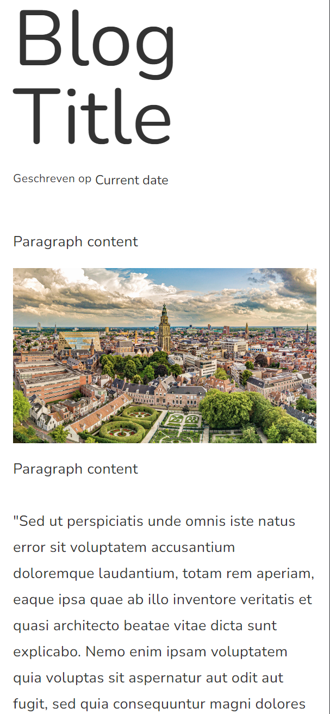

# Blog block

Blogs are a great way to supercharge your experiences.

---
> parameters
<br>
**$title** - string
<br>
**$date** - string
<br>
**$paragraph** - string
<br>
**$image** - string
<br>
**$secondParagraph** - string

### Usage

```blade
<x-blogs.block>
    <x-slot:title> Blog Title </x-slot:title>
    <x-slot:date> Current date </x-slot:date>
    <x-slot:paragraph> Paragraph content </x-slot:Paragraph>
    <x-slot:image> cover image </x-slot:image>
    <x-slot:secondParagraph> Paragraph content </x-slot:secondParagraph>
</x-blogs.block>
```


### Structure
```blade
<div class="flex mx-auto  max-w-screen-xl md:w-full lg:w-10/12 p-4 flex-col">

    <div class="pb-4">
        <p class="text-8xl text-bold">{{$title}}</p>
    </div>
    <div class="flex  gap-1 pb-8">
        <p>Geschreven op</p>
        {{$date}}
    </div>

    <!-- Add multiple blocks for extra paragraphs -->
    <div class="pb-4">
        <p class="pb-4 leading-8 text-lg">{{$paragraph}}</p>
        <div class="bg-error-content rounded w-full h-96">
            
        </div>
        <p class="pb-4 pt-4 leading-8 text-lg">{{$secondParagraph}}</p>
    </div>
</div>
```
### example

>