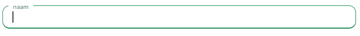

# input



Text fields let users enter and edit text. The TextField wrapper component is a complete form control including a label, input, and help text. It comes with three variants: outlined (default), filled, and standard.

### Usage
> **$id** - string
>The identifier must be unique across the page.
><br>
>
>**$name** - string
>The name attribute is used to reference elements in a JavaScript, or to reference form data after a form is submitted.
>Note: Only form elements with a name attribute will have their values passed when submitting a form.
><br>
>
>**$type** - text/email
><br>
>
>**$labelFor** - string
>When used together with the <label> element, the for attribute specifies which form element a label is bound to.
><br>
>
>**$label** - string
><br>
>
>**$required** - required

!> The required attribute may remain empty

```blade
<x-input.text-input>
    <x-slot:id>1</x-slot:id>
    <x-slot:name>email</x-slot:name>
    <x-slot:type>email</x-slot:type>
    <x-slot:placeholder>email</x-slot:placeholder>
    <x-slot:labelFor>floating_email</x-slot:labelFor>
    <x-slot:label>email adres</x-slot:label>
    <x-slot:required>required</x-slot:required>
</x-input.text-input>
```

### Structure
```blade
<div class="contact-form-textinput-container group">
    @if ($required->isNotEmpty())
        <input class="contact-form-textinput peer" type="{{$type}}" id="{{$id}}" {{$required}} name="{{$name}}" placeholder="{{$placeholder}}"/>
    @else
        <input class="contact-form-textinput peer" type="{{$type}}" id="{{$id}}" name="{{$name}}" placeholder="{{$placeholder}}"/>
    @endif
        <label for="{{$labelFor}}" class="contact-form-text-input-label  z-13">{{$label}}</label>
</div>
```
