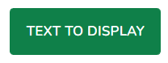

# Buttons

Buttons allows user to take actions or make choices.


> parameters <br>
**$slot** - string
---

> To use the buttons inside a Laravel Blade project we add it as following. Inside the tag we pass text as prop to be displayed inside the button.

```blade
<x-ui.buttons.medium.primary">

    Text to display

</x-ui.buttons.medium.primary>
```


---
> The buttons are structured as follows:
```blade
<x-ui.buttons.large.base {{$attributes->class('btn-primary w-full')}}>

    {{$slot}}

</x-ui.buttons.large.base>`
```
---
> There are different sizes and colours to choose from


| prefix  | Size       | Type      |
|---------|------------|-----------|
| buttons | extrasmall | Primary   |
| buttons | small      | secondary |
| buttons | medium     | accent    |
| buttons | Large      | info      |
| buttons | Large      | success   |
| buttons | Large      | warning   |
| buttons | Large      | error     |
| buttons | Large      | ghost     |
| buttons | Large      | link      |
| buttons | Large      | outline   |
| buttons | Large      | active    |
| buttons | Large      | disabled  |
| buttons | Large      | glass     |