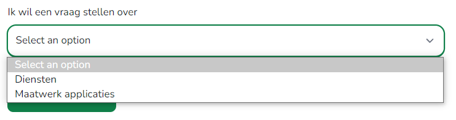

# Select

Select components are used for collecting user provided information from a list of options.



---
```blade
<label for="question_about" class="contact-form-select-label">
    Label text
</label>
<select class="contact-form-select" required id="#" name="">
    <option selected disabled>Selecteer</option>
    <option>Optie #1</option>
    <option>Optie #2</option>
</select>
</select>
```

