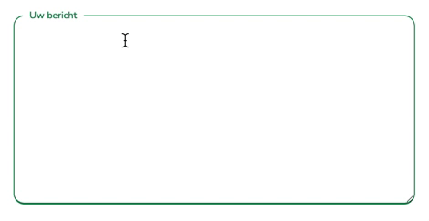

# Text area
Text fields let users enter and edit text. Text fields allow users to enter text into a UI. They typically appear in forms and dialogs.
A text area can hold an unlimited number of characters, and the text renders in a fixed-width font.
><b>Tip</b>: Always add the `<label>` tag for best accessibility practices!
> <br> <u>For this component the label is always required!</u>




### Usage
```Blade
<x-input.textarea>
    <x-slot:type>email</x-slot:type>
    <x-slot:name>email</x-slot:name>
    <x-slot:placeholder>Uw bericht</x-slot:placeholder>
    <x-slot:labelFor>floating_email</x-slot:labelFor>
    <x-slot:label>textarea</x-slot:label>
</x-input.textarea>
```

### Structure
```blade
<div class="contact-form-container-right ">
    <div class="contact-form-textinput-container group">
        <textarea class="contact-form-textarea peer" type="{{$type}}" required name="{{$name}}" placeholder="{{$placeholder}}"></textarea>
        <label for="{{$labelFor}}" class="contact-form-text-input-label">
            {{$label}}
        </label>
    </div>
</div>
```
