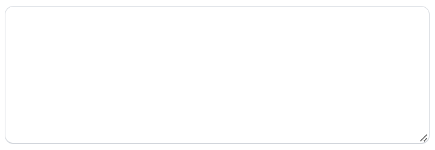

# Text area
Text fields let users enter and edit text.

Text fields allow users to enter text into a UI. They typically appear in forms and dialogs.



## Basic Textarea
The TextField wrapper component is a complete form control including a label, input, and help text. It comes with three variants: outlined (default), filled, and standard.

```blade
 <textarea
    class="
    textarea w-full h-48 textarea-bordered rounded-xl
    block w-full text-sm text-base-990 bg-transparent border
    border-b-2 border-gray-300 appearance-none dark:text-white
    dark:border-gray-400 dark:focus:border-primary
    focus:outline-none focus:ring-0 focus:border-primary peer"
    required
    placeholder="{{__('placeholder')}}"
    name="textarea-name"
>
</textarea>
```