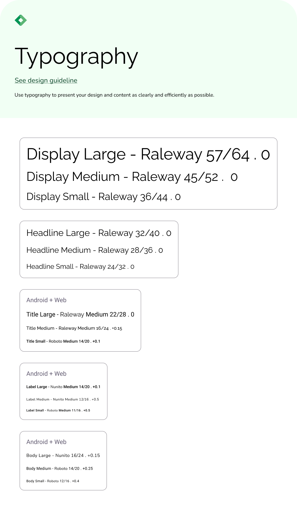

# Style guide

## Design elements

### Logo

#### Logo variations

---
#### Logo spacing

---
### Color palette

| Color        | HEX     |
|--------------|---------|
| "primary":   | #0F8049 |
| "secondary": | #1EC875 |
| "accent":    | #911BBA |
| "neutral":   | #454744 |
| "base-100":  | #fff    |
| "base-200":  | #efefef |
| "base-300":  | #0D1518 |
| "info":      | #6D97A3 |
| "success":   | #17A660 |
| "warning":   | #FFAD40 |
| "error":     | #FF5449 |

---
#### Accessible color combinations

> With the WCAG 2.1 guidelines in mind, applying color overlap is pre-defined in the style guide.

## Typography

---

### Typefaces
---
### Type uses
---
### Typesizes
---
## Spacing objects

### Spacing & layout
---
### Spacing & accessibility
---
### Grid
---
## User accessibility

### Perceptibility
---
### Operable
---
### Understandability
---
### Robust
---
### Consistency
---